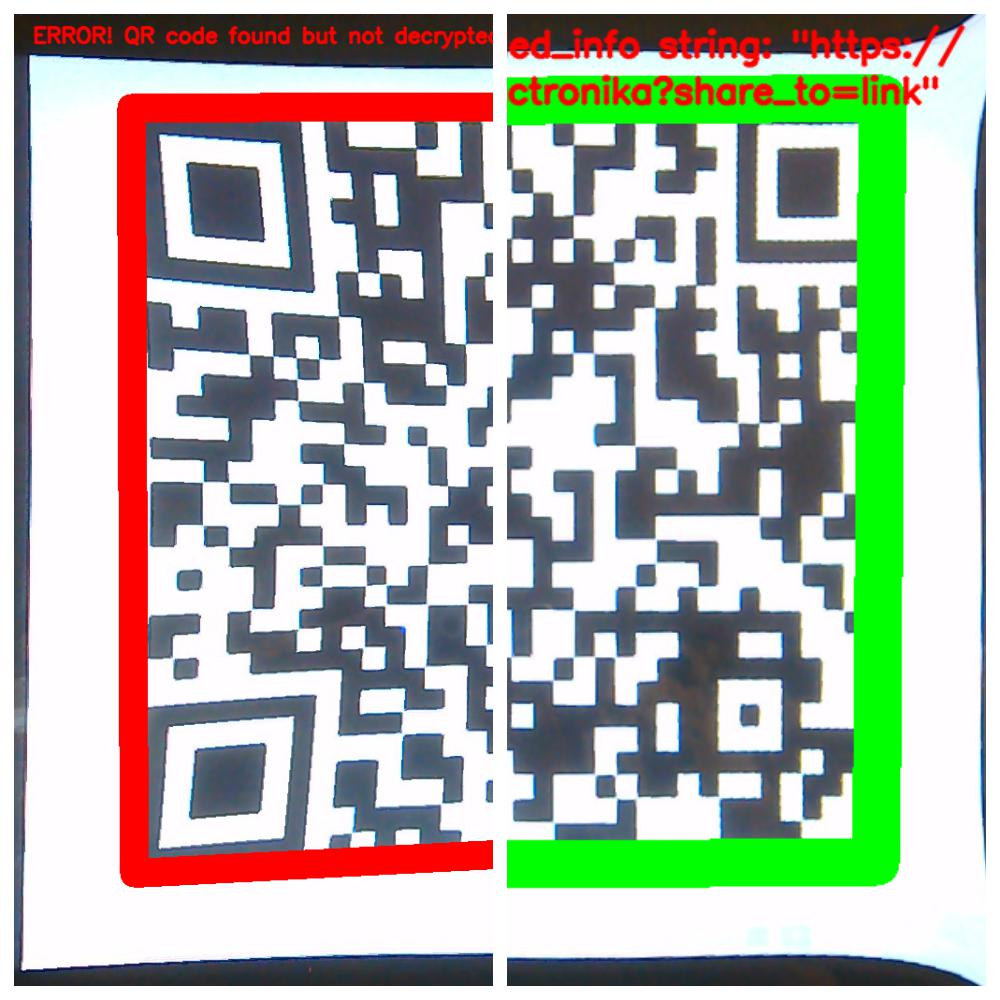
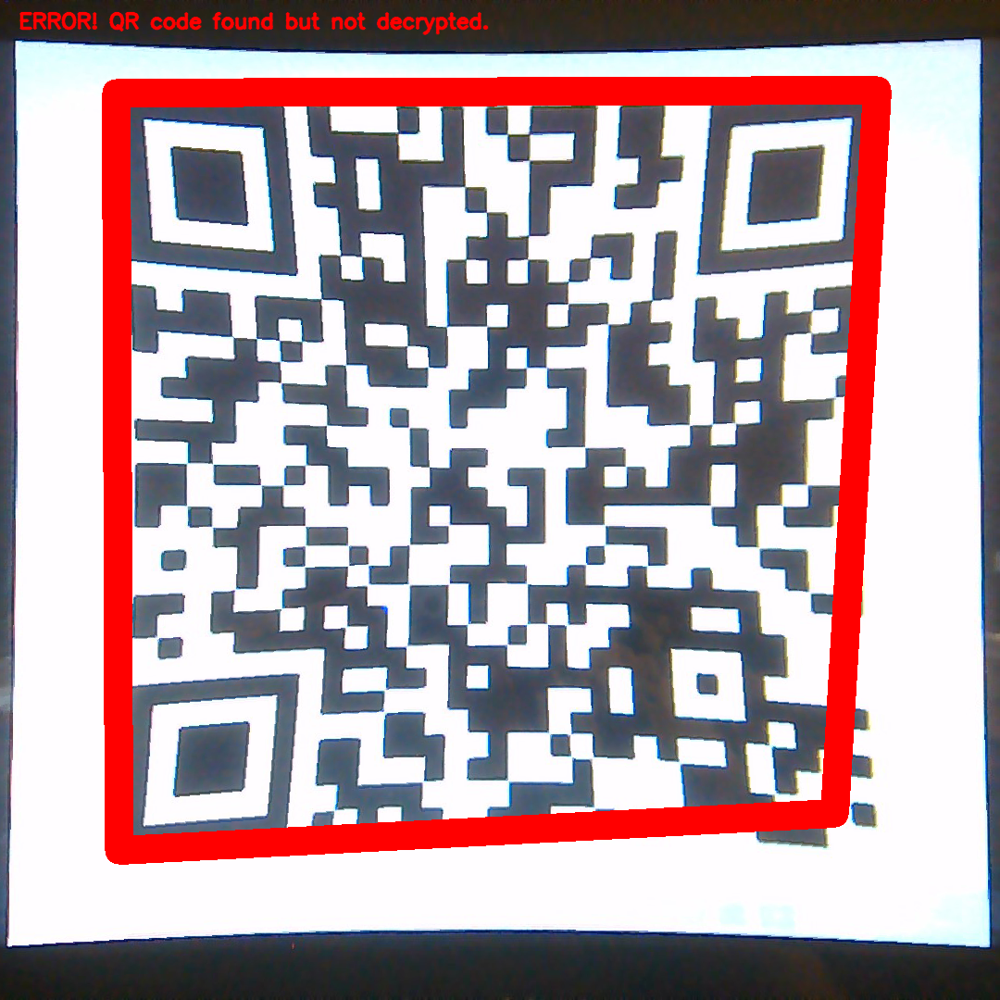
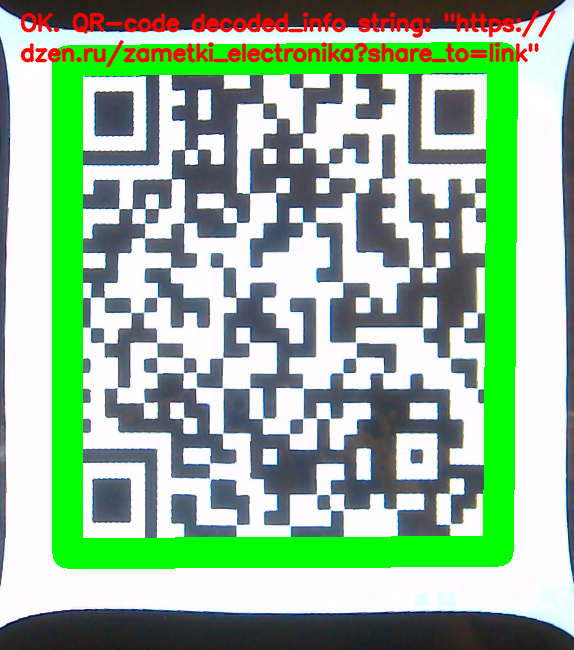

# Simple QR-code reader (Простой считыватель QR-кодов)  
Простой пример использования OpenCV для считывания QR-кодов, отметки их на фото и размещения текста с расшифрованной информацией.  

  

Примеры чтения QR-кода</b></i>

  

  

Пост на Дзене: [Простой считыватель QR-кодов](https://dzen.ru/media/zametki_electronika/prostoi-schityvatel-qrkodov-za-vecher-nabrosal-schityvatel-qrkodov-s-650168661aba9b0ba42af9eb).